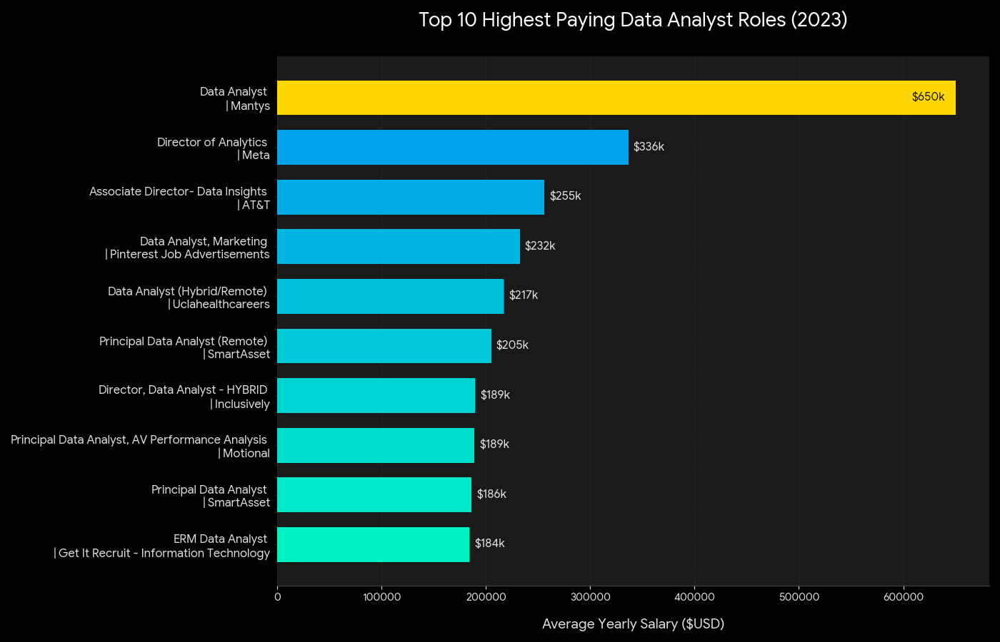
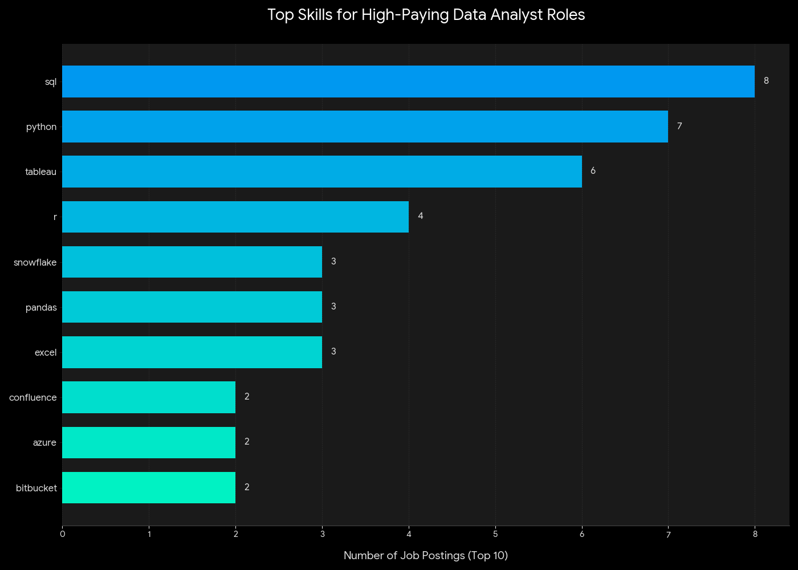
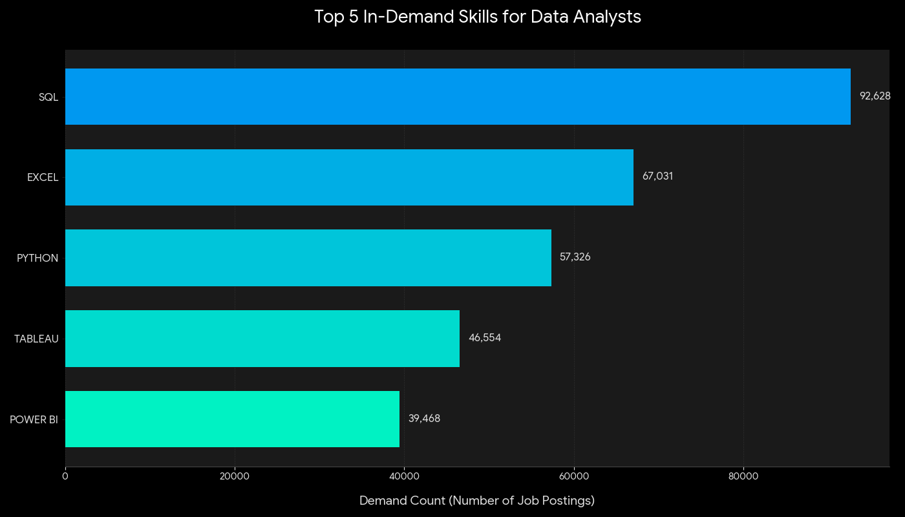
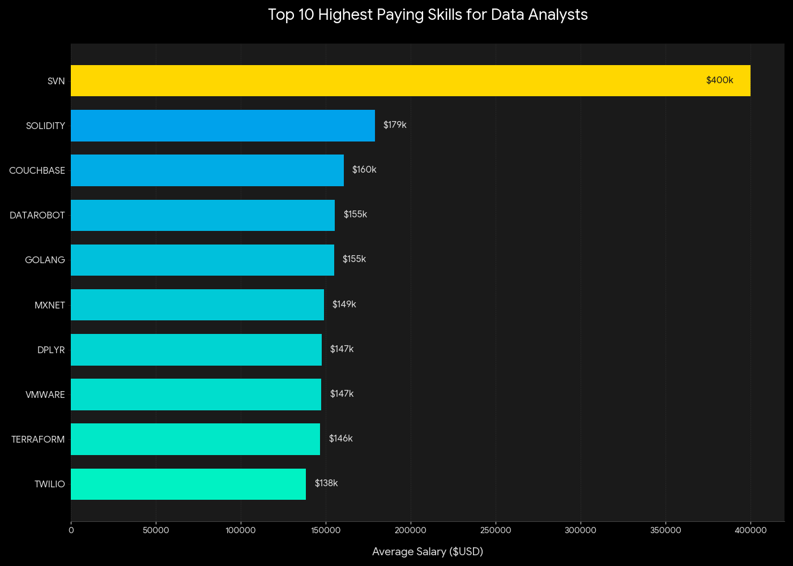
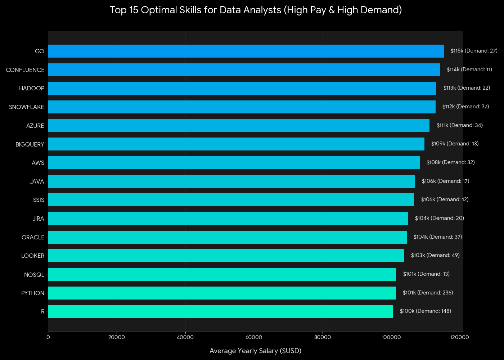

# Introduction
📊Dive into the data job market! Focusing on data analyst roles, this project explores top-paying jobs,🔥in-demand skills, and
where 📈 high demand meets high salary in data

• SQL queries? Check them out here: [project_sql folder](/project_sql/)

<br>

# Background
Driven by a quest to navigate the data analyst job market more effectively, this project was born from a desire to pinpoint top-paid and in-demand
skills, streamlining others work to find optimal jobs.
Data hails from my [SQL Course](https://lukebarouse.com/sql). It's packed with insights on job titles, salaries, locations, and essential skills.

### The questions I wanted to answer through my SQL queries :
1. What are the top-paying data analyst jobs?
2. What skills are required for these top-paying jobs?
3. What skills are most in demand for data analysts?
4. Which skills are associated with higher salaries?
5. What are the most optimal skills to learn?

<br>

# Tools I Used
For my deep dive into the data analyst job market, I harnessed the power of several key tools:

- **SQL:** The backbone of my analysis, allowing me to query the database and unearth critical insights.
- **PostgreSQL:** The chosen database management system, ideal for handling the job posting data.
- **Visual Studio Code:** My go-tg for database management and executing SQL queries.
- **Git & GitHub:** Essential for version control and sharing
my SQL scripts and analysis, ensuring
collaboration and project tracking

<br>

# The Analysis
Each query for this project aimed at investigating specific aspects of the data analyst job market.
Here's how I approached each question:

### 1.Top paying Data Analyst Jobs

**Objective:** To identify the highest-paying opportunities for Data Analysts in 2023. 

**Goal:** This query filters for the top 10 job postings with the highest average yearly salaries that offer remote flexibility ("Anywhere"). By narrowing down to these high-value roles, I can identify the specific companies and job titles that offer the greatest financial rewards in the current market.
```sql
SELECT 
    job_id,
    job_title,
    name AS company_name,
    job_location,
    job_schedule_type,
    salary_year_avg,
    job_posted_date
FROM 
    job_postings_fact
LEFT JOIN company_dim ON job_postings_fact.company_id = company_dim.company_id    
WHERE
    job_title_short = 'Data Analyst' AND
    job_location = 'Anywhere' AND
    salary_year_avg IS NOT NULL
ORDER BY
    salary_year_avg DESC
LIMIT 10
```
#### INSIGHTS
1. **Wide Salary Range:** The top 10 paying data analyst roles span from $184,000 to $650,000. This massive gap—driven largely by the $650k outlier at Mantys—indicates significant salary potential and high compensation ceilings within the field for specialized talent.

2. **Diverse Employers:** High salaries are not limited to one sector. Top-paying companies include tech giants like Meta, established telecommunications firms like AT&T, and financial service providers like SmartAsset, showing broad market demand across different industries.

3. **Job Title Variety:** There is a high diversity in job titles, ranging from Data Analyst and Marketing Data Analyst to leadership roles like Director of Analytics. This reflects a wide variety of specializations and seniority levels that fall under the broader "data analytics" umbrella.


*Bar graph visualizing the salaries for the top 10 highest-paying Data Analyst roles; ChatGPT generated this graph from my SQL query results.*

<br>

### 2.Top paying Skills for Data Analyst

**Objective:** To determine the specific skill sets required by the highest-paying employers.

 **Goal:** This query joins the job data with skill dimension tables to count which technical skills appear most frequently in the top-paying roles. By understanding this, I can pinpoint exactly which tools provide the highest "Return on Investment" (ROI) for learning as I prepare for a career transition.
```sql
WITH top_paying_jobs AS (
    SELECT 
        job_postings_fact.job_id,
        job_title,
        name AS company_name,
        salary_year_avg
    FROM 
        job_postings_fact
    LEFT JOIN company_dim ON job_postings_fact.company_id = company_dim.company_id
    WHERE 
        job_title_short = 'Data Analyst'
        AND job_location = 'Anywhere'
        AND salary_year_avg IS NOT NULL
    ORDER BY 
        salary_year_avg DESC
    LIMIT 10
)
SELECT 
    top_paying_jobs.*,
    skills
FROM 
    top_paying_jobs
INNER JOIN skills_job_dim ON top_paying_jobs.job_id = skills_job_dim.job_id
INNER JOIN skills_dim ON skills_job_dim.skill_id = skills_dim.skill_id
ORDER BY 
    salary_year_avg DESC
```
 Based on the analysis of the top-paying data analyst roles in 2023, here are the key insights regarding the skills required:
     
#### INSIGHTS     
1. **Most Frequent Skills**

The "Big Three" for high-paying data roles are clearly SQL, Python, and Tableau.These skills appear most frequently across the top job postings, indicating they are foundational for reaching the highest salary brackets.
     
* **SQL:** Mentioned in 8 out of the top postings.
* **Python:** Mentioned in 7 postings.
* **Tableau:** Mentioned in 6 postings.
* **R & Excel:** Both remain highly relevant, appearing in 4 and 3 postings respectively.
     

2. **Technical Ecosystems**

Beyond the core languages, the data reveals a preference for specific tools:
     
* **Cloud Platforms:** Snowflake and AWS are the leading cloud skills.
* **Libraries:** Pandas and NumPy are specifically called out, highlighting the need for deep data manipulation expertise in Python.
* **Collaboration:** Tools like Confluence, Jira, and Bitbucket appear, suggesting that these high-paying roles are often in structured, agile engineering environments.
     
3. **Salary Insights by Skill**

 While all these roles are "top-paying," certain skills are associated with slightly higher average benchmarks within this elite group:
     
* **Cloud & Big Data:** Skills like AWS ($222,569 avg) and Pandas ($215,609 avg) are linked to the very top of the pay scale.
* **Traditional Stats:** R and Excel actually maintain a very high average salary in these roles ($215k+), likely because they are often paired with senior-level domain expertise.


*Bar graph visualizing the most required skills for the top 10 highest-paying Data Analyst roles; ChatGPT generated this graph from my SQL query results.*

<br>

### 3.Most demanded Skills For Data Analysts

**Objective:** To identify the most in-demand skills for Data Analysts across the entire job market.

**Goal:** This query provides a high-level view of the skills that appear most frequently in job descriptions. By analyzing the total demand count, I can identify which tools are essential for maximizing employability and understanding the foundational requirements of the industry.
```sql
SELECT 
    skills,
    COUNT (skills_job_dim.skill_id) AS demand_count
FROM 
    job_postings_fact
    INNER JOIN skills_job_dim ON job_postings_fact.job_id = skills_job_dim.job_id
    INNER JOIN skills_dim ON skills_job_dim.skill_id = skills_dim.skill_id
WHERE 
    job_title_short = 'Data Analyst'
GROUP BY 
    skills
ORDER BY 
    demand_count DESC
LIMIT 5
```
#### INSIGHTS
1. **SQL is King:** With over 92,000 mentions, SQL is the most requested skill by a significant margin. It is nearly 40% more in-demand than the second-place skill (Excel), solidifying its status as the absolute foundation of data analytics.

2. **The Persistence of Excel:** Despite being an older tool, Excel remains the second most requested skill (67k+). This highlights that while advanced tools are growing, core spreadsheet proficiency is still required in the majority of data roles.

3. **The Programming Divide:** Python follows closely behind Excel. The gap between SQL and Python suggests that many roles focus more on data retrieval and management than on advanced automation or scripting.

4. **Visualization Duopoly:** Both Tableau and Power BI make the top 5. The combined demand for these two visualization tools exceeds 86,000, emphasizing that the ability to present insights is almost as important as the ability to extract data via SQL.


*Bar graph visualizing the total demand count for the top 5 most frequent skills in Data Analyst job postings; ChatGPT generated this graph from my SQL query results.*

<br>

### 4.Top paying skills for Data Analysts

**Objective:** To identify the technical skills associated with the highest average salaries for Data Analysts.

**Goal:** This query calculates the average yearly salary for each skill mentioned in job postings. By focusing on the top-paying tools, I can determine which niche specializations—such as Blockchain, Big Data, or Machine Learning—offer the highest financial compensation, helping to guide long-term career specialization.

```sql
SELECT 
    skills,
    ROUND(AVG (job_postings_fact.salary_year_avg),0) AS avg_salary
FROM 
    job_postings_fact
    INNER JOIN skills_job_dim ON job_postings_fact.job_id = skills_job_dim.job_id
    INNER JOIN skills_dim ON skills_job_dim.skill_id = skills_dim.skill_id
WHERE 
    job_title_short = 'Data Analyst' AND
    salary_year_avg IS NOT NULL
GROUP BY 
    skills
ORDER BY 
    avg_salary DESC
LIMIT 25
```

#### INSIGHTS

1. **AI and Machine Learning are High-Value Drivers**

A significant portion of the list is dominated by AI and Machine Learning libraries and platforms. Skills like DataRobot ($155k), MXNet ($149k), Keras ($127k), PyTorch ($125k), and TensorFlow ($120k) indicate that data analysts who can transition into data science or machine learning engineering roles command much higher salaries. The inclusion of Hugging Face ($123k) highlights the growing demand for Natural Language Processing (NLP) expertise.

2. **The "DataOps" and Infrastructure Trend**

Data analysts are no longer just looking at spreadsheets; they are increasingly involved in the deployment and automation of data pipelines.

- **DevOps/IaC:** Skills like Terraform ($146k), Ansible ($124k), and Puppet ($129k) suggest that "Infrastructure as Code" is becoming a premium skill for analysts who need to manage their own cloud environments.

- **Workflow Orchestration:** Airflow ($116k) and Kafka ($129k) show a shift toward real-time data streaming and complex workflow management.

3. **Specialized and Distributed Databases**

General SQL knowledge is foundational, but high salaries are tied to specialized data storage and retrieval systems. Couchbase ($160k) and Cassandra ($118k) represent NoSQL and distributed database expertise, which are critical for handling "Big Data" at scale.

4. **Niche and Legacy Systems (The SVN Outlier)**

SVN (Subversion) at $400,000 is a statistical outlier. While it is an older version control system mostly replaced by Git, this high figure likely represents highly specialized roles in legacy industries (like banking or government) or specific "maintenance" roles for high-stakes systems where experts are rare and migration is costly.

5. **Beyond Python and SQL**

While Python is the standard, other programming languages show significant earning potential:

- **Golang ($155k):** Known for its efficiency in building scalable data tools.
- **Scala ($115k):** Often used in conjunction with Spark for big data processing.
- **Perl ($124k):** Often used in legacy data processing and bioinformatics.
- **dplyr ($147k):** Specifically highlights that high-level mastery of R for data manipulation remains extremely lucrative.

**Summary of Salary Distribution**

- **Top Tier ($150k+):** Niche legacy skills, Blockchain (Solidity), and high-end AI automation (DataRobot).

- **Middle Tier ($125k - $150k):** Cloud infrastructure, DevOps tools, and advanced ML frameworks.

- **Entry-Top Tier ($115k - $125k):** Workflow orchestration, collaboration tools (Atlassian/Notion), and distributed big data tools.


*Bar graph visualizing the average yearly salary for the top 10 highest-paying technical skills; ChatGPT generated this graph from my SQL query results.*

<br>

### 5.Most Optimal Skills for Data Analysts

**Objective:** To identify the "Optimal Skills" for Data Analysts by finding the intersection of high demand and high compensation.

**Goal:** This final query analyzes skills that have a significant market presence (more than 10 postings) and ranks them by their average salary. This provides a strategic guide for prioritizing learning efforts toward tools that are not only common in the industry but also lead to higher-than-average pay.

```sql
SELECT 
    skills_dim.skills,
    COUNT(skills_job_dim.job_id) AS demand_count,
    ROUND(AVG(job_postings_fact.salary_year_avg), 0) AS avg_salary
FROM job_postings_fact
INNER JOIN skills_job_dim ON job_postings_fact.job_id = skills_job_dim.job_id
INNER JOIN skills_dim ON skills_job_dim.skill_id = skills_dim.skill_id
WHERE
    job_title_short = 'Data Analyst'
    AND salary_year_avg IS NOT NULL
    AND job_work_from_home = True 
GROUP BY
    skills_dim.skills
HAVING
    COUNT(skills_job_dim.job_id) > 10
ORDER BY
    avg_salary DESC,
    demand_count DESC
LIMIT 25;
```

#### INSIGHTS

1. **The Power Trio (Python, R, Tableau):** These three skills exhibit an incredible balance. While they are among the most in-demand (Demand: 236, 148, 230), they also maintain high average salaries around $100,000, making them the safest "high-value" bets for any analyst.

2. **Cloud-Native Premiums:** Skills like Snowflake ($112k), Azure ($111k), and AWS ($108k) show high salary averages with solid demand counts. Moving into cloud data warehousing is a clear path to increasing one's market value.

3. **Big Data & Programming:** Go and Hadoop lead the salary rankings in this "optimal" group. While their demand is lower than SQL or Python, their high average pay (>$113k) indicates a specialized market that pays a premium for these technical proficiencies.

4. **Modern vs. Legacy:** Even within high-paying roles, modern tools like Looker ($103k) are outperforming legacy systems, reinforcing the need for analysts to stay current with the modern data stack.


*Bar graph visualizing the average salary and demand count for the top 15 optimal skills for Data Analysts; ChatGPT generated this graph from my SQL query results.*

<br>

# What I Learned

This project was a deep dive into the 2023 data analyst job market, allowing me to strengthen both my technical SQL skills and my ability to translate raw data into actionable business insights.

- **Advanced SQL Querying:** I mastered the use of Joins and CTEs to connect multiple tables, such as job postings and skill dimensions. I practiced complex aggregations using COUNT() and AVG() to reveal market trends.

- **Data Cleaning & Filtering:** I learned the importance of filtering for specific job titles and ensuring salary data was present (IS NOT NULL) to maintain the integrity of my analysis and avoid skewed averages.

- **Identifying Market "Sweet Spots":** Through Query 5, I developed a methodology for identifying "Optimal Skills"—balancing high demand with high salary. This taught me how to look beyond single metrics to find true strategic value in data.


- **Strategic Career Planning:** As a Mechanical Engineering student, this project gave me a data-backed roadmap for my transition into analytics. I now know that while Excel gets you in the door, SQL, Python, and Cloud tools are the keys to long-term financial growth in this field.


<br>


# Conclusions

<br>

## INSIGHTS


This project provides a data-driven roadmap for anyone navigating the 2023 Data Analyst job market. By synthesizing salary data and skill demand, the following strategic conclusions can be drawn:

- **The "Golden Skills" for Career Growth:** SQL, Python, and Tableau are the essential pillars of a high-value data analyst profile. They boast the highest demand counts while consistently commanding salaries in the $100,000+ range.

- **Specialization Pays Off:** While generalist tools like Excel have high volume, niche specializations in Cloud Infrastructure (Snowflake, AWS, Azure) and Big Data (Hadoop, Go) offer significantly higher average salaries. For maximum earning potential, moving from general data cleaning to cloud-based architecture is the most effective path.


- **Seniority is the Primary Salary Driver:** The transition from "Data Analyst" to "Principal" or "Director" roles nearly doubles the earning potential, emphasizing the importance of long-term experience and leadership skills in addition to technical proficiency.

- **Final Recommendation:** For an aspiring analyst, the most efficient path to success is to first master SQL for employability, then move immediately to Python and Cloud tools to secure a position in the higher salary brackets.


<br>

## CLOSING THOUGHTS
This analysis helps to understand that the data landscape is as much about strategy as it is about syntax. While the sheer volume of "Data Analyst" roles is encouraging, the data reveals a clear hierarchy: technical depth in SQL and Python combined with Cloud expertise is what separates a standard role from a top-tier career.

As a Mechanical Engineering student pivoting into this field, this project has been more than just a technical exercise; it has been a confirmation that the analytical mindset cultivated in engineering is highly transferable and lucrative in the digital economy. The high demand for remote-first, senior-level data professionals proves that for those willing to master the "Optimal Skills," the ceiling for growth is remarkably high.

Ultimately, this project serves as a reminder that in data analytics—just like in any other engineering discipline—choosing the right tools for the right problem is the ultimate key to success.